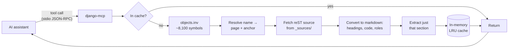

# django-mcp

[](https://www.npmjs.com/package/django-mcp)
[](https://github.com/ajaymahato431/django-mcp/actions/workflows/ci.yml)
[](LICENSE)
[](https://nodejs.org)
[](https://modelcontextprotocol.io)

Ask an AI assistant what a Django setting does, or which arguments a queryset
method takes, and you will often get an answer that is plausible, confident, and
subtly wrong — a keyword argument removed two releases ago, or a setting that
never existed. The model is recalling training data, and it has no way to check.

**django-mcp** is a [Model Context Protocol](https://modelcontextprotocol.io)
server that gives the assistant a way to check. It reads Django's own published
object inventory — around 8,100 documented settings, template tags, field
lookups, classes and methods — so it can resolve a name like `INSTALLED_APPS`
straight to its documentation and return **only that section**. It runs locally,
needs no API key, and writes nothing to disk.

---

## Contents

- [How it works](#how-it-works)
- [Requirements](#requirements)
- [Installation](#installation)
- [Connect it to your editor](#connect-it-to-your-editor)
- [Tools](#tools)
- [Configuration](#configuration)
- [Usage examples](#usage-examples)
- [Troubleshooting](#troubleshooting)
- [Upgrading from 1.x](#upgrading-from-1x)
- [Contributing](#contributing)
- [License](#license)

---

## How it works

Sphinx — the toolchain behind the Django docs — publishes two things this server
exploits: a compressed inventory of every documented object, and the original
reStructuredText source of every page.



The inventory is one ~110 KB download, cached for a day. It is what makes the
difference between *"here is the settings reference"* and *"here is
`INSTALLED_APPS`"*:

| Question | Naive approach | With django-mcp |
| --- | --- | --- |
| What does `INSTALLED_APPS` do? | Read `ref/settings` — **~27,000 tokens** | `symbol: "INSTALLED_APPS"` — **~390 tokens** |
| How does `select_related()` work? | Read `ref/models/querysets` — ~37,000 tokens | `symbol: "select_related"` — ~1,000 tokens |
| Where is `icontains` documented? | Guess, or grep | `search_django_docs` — ~200 tokens |

---

## Requirements

- **Node.js 20 or later** — check with `node --version`
- An MCP-capable client (Claude Code, Claude Desktop, Cursor, Cline, Windsurf,
  Antigravity, or anything else that speaks MCP)
- Outbound HTTPS access to `docs.djangoproject.com`

No API key, account, or database is required. **Python and Django do not need to
be installed** — the server reads published documentation, not your project.

---

## Installation

### Option A — npx (recommended)

Nothing to install. Point your MCP client at `npx` and it fetches the package on
first run. Jump straight to [Connect it to your editor](#connect-it-to-your-editor).

### Option B — global install

```bash
npm install -g django-mcp
django-mcp --version
```

### Option C — from source

<details>
<summary><strong>Linux and macOS</strong></summary>

```bash
git clone https://github.com/ajaymahato431/django-mcp.git
cd django-mcp
npm install
node index.js --version
```

</details>

<details>
<summary><strong>Windows (PowerShell)</strong></summary>

```powershell
git clone https://github.com/ajaymahato431/django-mcp.git
cd django-mcp
npm install
node index.js --version
```

</details>

The server speaks JSON-RPC over stdio. Running `node index.js` by hand will look
like it has hung — it is waiting for a client. Use `--help` to inspect it.

---

## Connect it to your editor

### Claude Code

```bash
claude mcp add django-docs -- npx -y django-mcp
```

### Claude Desktop

Edit `claude_desktop_config.json`:

- **macOS** — `~/Library/Application Support/Claude/claude_desktop_config.json`
- **Windows** — `%APPDATA%\Claude\claude_desktop_config.json`
- **Linux** — `~/.config/Claude/claude_desktop_config.json`

```json
{
  "mcpServers": {
    "django-docs": {
      "command": "npx",
      "args": ["-y", "django-mcp"]
    }
  }
}
```

### Cursor

Edit `.cursor/mcp.json` in your project, or `~/.cursor/mcp.json` globally, using
the same `mcpServers` block.

### Cline / Roo (VS Code)

Edit `cline_mcp_settings.json` via **MCP Servers → Configure**, using the same block.

### Antigravity

Edit `~/.gemini/config/mcp_config.json` (on Windows,
`%USERPROFILE%\.gemini\config\mcp_config.json`), using the same block.

### Running from a local clone

```json
{
  "mcpServers": {
    "django-docs": {
      "command": "node",
      "args": ["/path/to/django-mcp/index.js"]
    }
  }
}
```

Use the full path to your clone. On Windows either escape the backslashes
(`"C:\\path\\to\\django-mcp\\index.js"`) or use forward slashes.

### Matching your project's Django version

This matters more here than in most servers — settings and queryset methods
change between releases:

```json
{
  "mcpServers": {
    "django-docs": {
      "command": "npx",
      "args": ["-y", "django-mcp"],
      "env": { "DJANGO_DOCS_VERSION": "5.2" }
    }
  }
}
```

Restart your client after editing its configuration.

---

## Tools

Four tools are exposed. All are read-only.

| Tool | Purpose | Typical cost |
| --- | --- | --- |
| `search_django_docs` | Find any documented symbol or page | ~200 tokens |
| `read_django_docs` | Read a page, a section, or a single symbol | 300–1,500 tokens with `symbol` |
| `list_django_docs` | Browse the documentation index | ~80 tokens |
| `django_best_practices` | Curated guidance and anti-patterns | ~150–900 tokens |

### `search_django_docs`

| Argument | Type | Default | Description |
| --- | --- | --- | --- |
| `query` | string | **required** | What to look for, e.g. `ForeignKey`, `select_related`. |
| `role` | enum | — | Narrow to one kind of object (below). |
| `maxResults` | integer | `10` | Number of results (`SEARCH_MAX_RESULTS`). |

`role` accepts `page`, `setting`, `templatetag`, `templatefilter`, `fieldlookup`,
`class`, `method`, `attribute`, `module`, `command`, and `label`.

Dotted names are matched on their last segment, so searching `ForeignKey` finds
`django.db.models.ForeignKey` without you having to know the full path.

### `read_django_docs`

| Argument | Type | Default | Description |
| --- | --- | --- | --- |
| `symbol` | string | — | A documented name. Resolves to its page and returns just that section. |
| `path` | string | — | Page path, e.g. `topics/db/models`. Required unless `symbol` is given. |
| `section` | string | — | Return only this heading's content. |
| `outline` | boolean | `false` | Return only the page's headings. |

**Prefer `symbol`.** It is the cheapest and most precise way to answer a specific
question, and it reports the resolved role and a deep link to the anchor.

`section` matching prefers an exact heading, then a prefix, then a substring, and
compares against both the formatted heading and its bare form — so `DEBUG`
returns the `` `DEBUG` `` setting rather than the `Debugging` section above it.

### `list_django_docs`

| Argument | Type | Default | Description |
| --- | --- | --- | --- |
| `section` | string | — | Section to list. Omit for the summary. `"all"` lists every page. |
| `limit` | integer | all | Maximum pages to return. |
| `offset` | integer | `0` | Pages to skip, for paging. |

```
# Django 6.0 documentation
665 pages across 9 sections.

  releases — 389 pages
  ref — 119 pages
  topics — 67 pages
  howto — 34 pages
  internals — 22 pages
  intro — 13 pages
  (top-level) — 10 pages
  faq — 8 pages
  misc — 3 pages
```

> Most of the page count is release notes. Reach for `search_django_docs` rather
> than listing the `releases` section.

### `django_best_practices`

| Argument | Type | Default | Description |
| --- | --- | --- | --- |
| `topic` | enum | — | One of `architecture`, `models`, `views`, `templates`, `forms`, `security`, `performance`, `testing`. Omit for all. |

Answers instantly, with no network access.

---

## Configuration

Precedence is **CLI flag → environment variable → built-in default**.

| Flag | Environment variable | Default | Description |
| --- | --- | --- | --- |
| `--docs-version` | `DJANGO_DOCS_VERSION` | `6.0` | Docs version: `6.0`, `5.2`, `4.2`, `stable`, `dev` |
| `--timeout` | `REQUEST_TIMEOUT_MS` | `15000` | Per-request timeout (ms) |
| `--retries` | `REQUEST_RETRIES` | `2` | Retries for transient failures |
| `--cache-max` | `CACHE_MAX_ENTRIES` | `100` | Maximum cached documents |
| `--doc-ttl` | `DOC_TTL_MS` | `10800000` | Page cache lifetime (3 hours) |
| `--index-ttl` | `INDEX_TTL_MS` | `86400000` | Inventory cache lifetime (24 hours) |
| `--negative-ttl` | `NEGATIVE_TTL_MS` | `60000` | How long a failed fetch is remembered |
| `--max-results` | `SEARCH_MAX_RESULTS` | `10` | Default search result count |
| `--env-file` | — | — | Load a specific `.env` file |
| `--help` | — | — | Show help and exit |
| `--version` | — | — | Show the version and exit |

### Using a `.env` file

```bash
cp .env.example .env
```

Edit it and restart. A missing `.env` is not an error — every value has a
default. Variables already set in the environment (including your MCP client's
`env` block) always win over the file.

`.env` is git-ignored. Only `.env.example`, which contains no secrets, is
committed. This server needs no credentials at all.

### Why there is no Dockerfile

This server is launched as a subprocess by your editor and talks over stdio; it
is not a long-running service. A container would add a process boundary and
startup cost without providing isolation your editor does not already have.
`npx` is the intended distribution.

---

## Usage examples

**Checking a setting before using it**

> "Look up `CSRF_TRUSTED_ORIGINS` in the Django docs and tell me the correct
> format for the values."

**Getting a method's real signature**

> "What arguments does `select_related()` take? Check the docs."

**Fixing an N+1 problem**

> "Read the Django best practices for models, then review this view for N+1
> queries."

**Finding where something is documented**

> "Where is the `icontains` lookup documented?"

**Matching an older project**

Set `DJANGO_DOCS_VERSION=4.2` and the same questions return 4.2 answers.

**Calling a tool directly** (from a client that supports it)

```json
{ "name": "read_django_docs", "arguments": { "symbol": "INSTALLED_APPS" } }
```

---

## Troubleshooting

<details>
<summary><strong>The server does not appear in my client</strong></summary>

Restart the client after editing its configuration — most read it only at
startup. Then check `node --version` is 20 or later, and validate your JSON.

Verify the server runs on its own:

```bash
npx -y django-mcp --version
```

</details>

<details>
<summary><strong>"spawn npx ENOENT" on Windows</strong></summary>

Some clients cannot resolve `npx` from a bare name. Use the full path:

```powershell
(Get-Command npx).Source
```

Put that in `command`, or install globally with `npm install -g django-mcp` and
use `django-mcp` as the command.

</details>

<details>
<summary><strong>"Could not read the object inventory"</strong></summary>

`DJANGO_DOCS_VERSION` probably names a version that is not published. Valid
values are those that appear at `docs.djangoproject.com/en/<version>/` — for
example `6.0`, `5.2`, `4.2`, `stable` or `dev`.

</details>

<details>
<summary><strong>Requests time out</strong></summary>

```json
"env": { "REQUEST_TIMEOUT_MS": "45000", "REQUEST_RETRIES": "4" }
```

Behind a corporate proxy, set `HTTPS_PROXY` in the same `env` block. Node
respects it natively from version 20.

</details>

<details>
<summary><strong>A symbol is not found</strong></summary>

Only documented objects are in the inventory — private helpers and undocumented
internals are not. Use `search_django_docs` first; it suggests close matches.
Note also that the symbol must exist in the *configured* version.

</details>

<details>
<summary><strong>The answer is for the wrong Django version</strong></summary>

Call `list_django_docs` and check the heading names the version you expect. If
not, set `DJANGO_DOCS_VERSION` to match your project.

</details>

<details>
<summary><strong>Responses are too large</strong></summary>

Use `symbol` rather than `path` wherever you can. Failing that, use `section`, or
`outline: true` first to see what the headings are. Avoid `section: "all"` on
`list_django_docs`.

</details>

---

## Upgrading from 1.x

- **`list_django_docs` no longer takes a `path`.** It served one `toctree` level
  at a time, so finding a page meant walking the tree. It now returns the whole
  page list from the inventory, and with no arguments gives a section summary.
  Pass `section: "all"` for every page.
- **`search_django_docs` is new** — there was no search before.
- **`read_django_docs` accepts `symbol`**, which is usually what you want.
- **Node.js 20 or later** is required.

If your MCP configuration uses an absolute path to `index.js`, consider switching
to `npx -y django-mcp`.

Full details are in the [changelog](CHANGELOG.md).

---

## Related servers

Built on the same core, for the rest of the stack:

- [filament-mcp](https://github.com/ajaymahato431/filament-mcp) — Filament documentation
- [livewire-mcp](https://github.com/ajaymahato431/livewire-mcp) — Livewire documentation

---

## Contributing

Contributions are welcome — see [CONTRIBUTING.md](CONTRIBUTING.md). Please also
read the [Code of Conduct](CODE_OF_CONDUCT.md), and report security issues via
[SECURITY.md](SECURITY.md) rather than a public issue.

```bash
npm test                  # offline unit tests
npm run test:integration  # against the live documentation
```

## License

Released under the [MIT License](LICENSE). © 2026 Ajay Mahato.

Django is a registered trademark of the Django Software Foundation. This project
is not affiliated with or endorsed by the DSF; it only reads the public
documentation.
